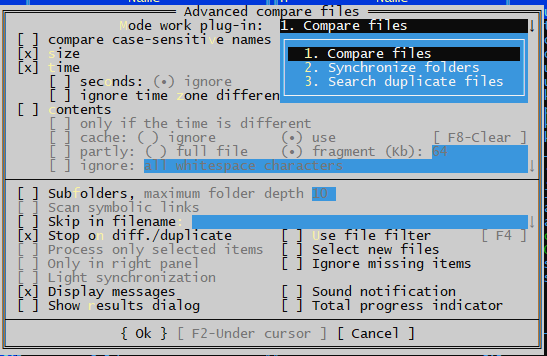

# AdvCmpEx
Plugin for advanced compare of files in Far Manager 3.

# Common info
* Extracted from: https://github.com/FarPlugins/farplug-alvls
* PlugRing page: https://plugring.farmanager.com/plugin.php?pid=19
* Discuss: https://forum.farmanager.com/viewtopic.php?t=1526

Build scripts:

CompilePlugVC.bat - build x86 edition and copy out files in to .\x86 dir
CompilePlugVCx64.bat - build x86 edition and copy out files in to .\x64 dir

NOTES:

The current build scripts are configured to use VC2010 to provide support for
Windows XP. Starting with VC2019, Microsoft removed the toolkit for this OS
version and the minimum OS version for which Windows Vista and newer can be
built from MSVS.

To use newer compilers, edit the "Use Microsoft Visual Studio" block like this:

rem ===================== Use Microsoft Visual Studio ==========================

if exist "%VS160COMNTOOLS%..\..\VC\Auxiliary\Build\vcvarsall.bat" (
  call "%VS160COMNTOOLS%..\..\VC\Auxiliary\Build\vcvarsall.bat" x86
) else (
  call "C:\Program Files (x86)\Microsoft Visual Studio\2019\Community\VC\Auxiliary\Build\vcvarsall.bat" x86
)

specifying in it the paths to the necessary compilers.